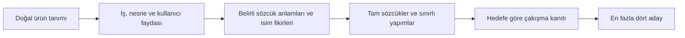

# İsim kalitesi için mimari karar

6 Eylül 2026 · Araştırma kararı; üretim değişikliği veya kanıtlanmış kalite artışı değil.

**Önerim: developer ürünlerini anlayan, sözcüklerin belirli anlamlarından isim fikirleri çıkaran ve tam isim biçimini koruyan bir isimlendirme motoru.** Rust/WASM ve çevrimdışı çalışma devam eder. Asıl yatırım, ürün bilgisi ile iyi isim malzemesini bağlayan bir veri varlığına yapılır. Seçici, bundan çıkan az sayıdaki adayı sunar.

Bu, kalan seçenekler arasında en güçlü gerekçeye sahip yön. Kesin başarı sağlayan “nihai algoritma” bulunduğunu söylemek için kanıt yok. Buna karşılık, mevcut yaklaşımın neden dönüp dolaşıp zayıf isimlere geldiğine ilişkin artık somut kanıt var.

## Kararı değiştiren bulgular

| Doğrulanan bulgu | Anlamı ve sınırı |
| --- | --- |
| Mevcut 35 kanonik brief, değiştirilmemiş WASM üzerinde tekrar çalıştırıldı. Deneysel `brief_pool` yalnızca 2 brief'te finalist verdi; 14 developer brief'inin tamamında `no_explicit_operation` ile durdu. Hiçbirinde fayda çerçevesi bulunmadı. | “a CLI for database migrations”, “an API rate limiting library”, “a terminal log viewer” gibi doğal ürün tanımları bile kapsam dışında. Son kontrollü fiil kalıplarındaki başarı, genel ürün anlayışı değil. Bu **Auto regresyonu veya yeni kör kalite testi değil**, deneysel akışın kapsam ölçümü. |
| Sekiz fayda çerçevesinin 24 tam sözcüğünden 22'si çakışma filtresinde, biri daha önce harf dizilimi (`phonotactics`) filtresinde eleniyor. Yalnızca `reprise` üretiliyor. | Yedi çerçeve tam sözcük seçeneğini finaliste taşıyamıyor. Sistem birleşik ve kırpılmış biçimlere itiliyor. Elenen sözcüklerin iyi ya da kullanılabilir isim olduğu sonucu çıkmaz. |
| Bu 24 sözcüğün 23'ü gerçek crate snapshot'ında; 12'si marka korpusunda da var. | Sorun Bloom yanlış pozitiflerinden ibaret değil. Tek bir global liste, paket kimliği ile ürün adı arasındaki farkı taşıyamıyor. Listedekileri topluca serbest bırakmak çözüm değil. |
| Geçmişte zaten 174 gerçek kullanıcı kararı toplanmış: 150 ana çiftin 77'sinde “Neither”; 73 belirleyici tercih; tekrar uyumu 13/24. | “Önce biraz tercih toplayalım” denenmemiş bir yol değil. Dondurulmuş öğrenici, gereken 120 belirleyici tercih ve 20/24 tekrar uyumu oluşmadığı için eğitimden önce durmuş. |
| Aynı koleksiyondan türetilen 201 etiketle ayrı yazım kabul modeli AUC 0.5932 elde etmiş; yalnızca kısalık kullanan karşılaştırma 0.6159. | Genel yazım beğenisi öğrenmek mevcut veride gösterilmiş bir çözüm değil. 201 etiket, 201 yeni insan kararı değil. |
| Son havuz incelemesindeki 21 asistan tercihinin 17'si zaten finalistti. Sonraki parça filtresi 170 adayı 84'e indirirken beş asistan tercihini kaybetti. | Seçimde kayıp var, fakat geniş bir iyi isim rezervi gösterilemedi. Bu sayılar insan beğenisi kanıtı değil. |

Kapsam deneyi iki çalıştırmada aynı sonucu verdi. Önceki teslimdeki **132 kaynak dosyasının hash'i aynı**. Tam kayıtlar: [coverage.json](artifacts/coverage.json), [tekrar doğrulaması](artifacts/coverage-replay.json), [24 sözcüğün tek tek akıbeti](artifacts/anchors.json).

Önceki “tercih verisi toplayıp küçük model eğitelim” önerimi düzeltiyorum: eldeki gerçek koleksiyon ve başarısız öğrenme girişimleri hesaba katılmadan bu yön yeniden önerilmemeliydi. Eski araştırma README'sindeki “insan verisi henüz toplanmadı” cümlesi de güncellendi. Ham kullanıcı koleksiyon dosyaları bu incelemede bulunmadı; insan sayımları saklanmış, hash bağlantıları bulunan raporlar ve türetilmiş etiketlerden doğrulandı.

## Seçilen ürün ve mimari

Motorun temel nesnesi bir kök parçası değil, **ürünle bağlantısı olan bir isim fikri** olmalı. İsim, ürün açıklamasını iki sözcükle tekrar etmek zorunda değil. Bir ürünü çağrıştıran bütün bir sözcük, anlamlı bir türetme veya anlaşılır bir birleşim geçerli biçimlerdir.



1. **Doğal ürün tanımı anlaşılacak.** Fiilli cümlelerin yanında “log viewer”, “database migrations”, “job scheduler” gibi ad öbekleri tanınacak. Bağlam, eşanlamlar, olumsuzluk ve belirsizlik ayrı tutulacak. Çözülemeyen girdide genel isimlere sessiz geçiş yerine kısa, düzeltilebilir bir ürün yorumu gösterilecek. Kullanıcı her aramada uzun bir anket doldurmayacak.
2. **Belirli anlamları içeren bir isimlendirme sözlüğü derlenecek.** Her kayıt ürün faydasını, uygun/uygunsuz bağlamları, sözcük anlamını, kaynak ve lisansını, telaffuzu ve izin verilen yapımları taşıyacak. Örneğin bir geri alma ürününün isim fikri yalnızca `restore + file` değildir; geri dönüş, önceki hâli koruma ve güvenli deneme gibi ayrı anlam yönleri vardır. Bu örnekler aday isim veya müsaitlik önerisi değildir.
3. **Tam biçim korunacak.** Bir kavram bulunduğunda karakter üreticisine parçalanıp yeniden örnekletilmeyecek. Doğrudan sözcükler ve anlamını koruyan az sayıda yapım ilk sınıf seçenek olacak. Mevcut üreticiler ek keşif yolları olarak kalabilir; her ailenin zorunlu finalist payı olmayacak. Açıklamanın uzunluğu ve varlığı estetik puan olmayacak. Parça sözlüğü, bütün ismin kalitesini belirleyen evrensel veto olmayacak.
4. **Ürün adı ile paket kimliği ayrılacak.** `DisplayName` ve `IdentifierCandidate`, hedef registry, kaynak, snapshot sürümü/tarihi ve çakışma türü taşıyacak. Hedef crates.io ise alınmış crate kimliği elenir; aynı ürün alanındaki bilinen isim çakışmaları ciddiye alınır. Başka bir registry'deki ortak sözcük kullanımı, tek başına bütün ürün adları için global karar olmaz. Scope bilinmiyorsa kesin hüküm verilmez. Güncel müsaitlik, snapshot'ta yokluktan türetilmez.
5. **Az ve farklı isim fikri sunulacak.** En fazla dört finalist; yetersizse daha az. Kullanıcı bir anlam yönünü tuttuğunda devam sayfası bunu izleyebilir. İleride normal kullanımda görülen adaylar ve açık son seçimler yerel olaylar olarak kaydedilir; eski beğeniler korunur. Şimdi yeni bir uzun etiket kampanyası veya tat modeli yapılmaz.

Bu yön, kapanmış WordNet/ConceptNet deneylerinin eşiklerini düşürerek yeniden açılması değildir. Ham sözlük komşuluğu yerine ürün anlamına bağlanmış kayıtlar; rastgele yazım yerine tam biçimler; global yasak listesi yerine hedef kullanım kanıtı öneriliyor. Maliyeti esas olarak özenli veri hazırlama ve ürün kapsamıdır. Dört alanda çalışması bütün ürünlerde çalışacağını göstermez.

## İlk uygulanacak dilim ve durma kuralı

Bir büyük yeniden yazım veya yeni Lab seçenekleri serisi yerine **tek bir sınırlı dilim**:

- Dört developer alanı: veri geçişi/geri alma, arka plan işi/kuyruk yönetimi, gözlemlenebilirlik, yapılandırma/artifact doğrulama. Mevcut 35 brief ve eski 12 örnek yalnızca geliştirme/regresyon malzemesi olur.
- `ProductMeaning`, `NamingConcept`, `NameConstruction`, `CollisionEvidence`, `NamingTarget` sözleşmeleri tanımlanır. Veriler, anlam bağlantıları ve yapım kuralları değerlendirme çıktıları açılmadan dondurulur. Mevcut `CandidateProposal`/`CandidateTrace` ile finalist bileşenleri kullanılır; üretim API'si ve kayıtlı beğeniler korunur.
- Önce tüm adaylar **seçimden önce** incelenir: anlam yorumu → kavram bulma → isim yapımı → telaffuz → hedef çakışması → seçim. Beğenilen eski markalar yalnızca biçim uzayını denetleyen referanslardır; üretim tohumu, yeni isim önerisi veya kör olumlu etiket değildir.
- Aynı protokolde hedef isim kullanımı önceden belirlenir. Global çakışma politikası üretimde sessizce gevşetilmez. Yeni hedef ayrımı yalnızca deneyde açıkça gösterilir; iki koldaki isimler aynı nihai kullanım şartıyla değerlendirilir. Auto üretimi ve eski kontrol eşikleri değişmez.
- Bu dilim anlamlı bir aday türü sunabiliyorsa, veriden bağımsız **12 yeni developer brief'i ve dört tekrar** ile tek kısa kör karşılaştırma yapılır. Ana adaylar önce açıklamadan bağımsız görülür; “ikisi de değil” ve gerçekten kullanılabilirlik ayrı kaydedilir. Açıklama ve çakışma bilgileri iki kolda aynı şekilde sunulur. Asistan seçimi insan sonucu sayılmaz.

**Üretime aday olma eşikleri değişmiyor:** en az 8/12 karşılaştırma kazanımı, en az altı brief'te kullanılabilir aday, bu sayıda Auto'nun en az üç brief önüne geçme, en az 3/4 tekrar uyumu. Bunların hepsi birlikte gerekir. Yeni protokol/model çıktıları için eski karşılaştırma sayfaları tekrar kanıt sayılamaz.

Bu farklı aday kaynağı da insan kapısını geçemezse kapsamı sonsuza kadar büyütmeyeceğiz. Tam otomatik, genel amaçlı, çevrimdışı isim kalitesi vaadini daraltıp **isim fikirleri üzerinde birlikte çalışılan bir ürün** yönüne geçmek daha dürüst olur. Bu bir imkânsızlık teoremi değil; ek yatırım için durma kararıdır. LLM sınırını değiştirmek ayrıca kullanıcının kararıdır.

## Artık ana yatırım olmayacak işler

- Daha fazla karakter üreticisi, genel hece estetiği veya tek örneğe göre puan cezası.
- Otomatik skor artışını kullanmak istenen isim artışı saymak.
- Beğenilen markaların harf/hece biçimini taklit eden yeni bir genel model.
- Asistan seçkisini insan etiketi yapmak; geçmişte gösterilmeyen isimleri beğenilmemiş saymak.
- Aynı dar brief'ler üzerinde yeni filtreleri üst üste eklemek ve bunları yeni kalite deneyi diye sunmak.
- Çakışan bütün sözcükleri serbest bırakmak veya kanıtsız müsaitlik göstermek.

## Makaleler bu kararı ne kadar destekliyor?

[Saunders 2023](https://aclanthology.org/2023.sigmorphon-1.10/) ve [Pollet ve diğerleri 2021](https://computationalcreativity.net/iccc21/wp-content/uploads/2021/09/ICCC_2021_paper_76.pdf), sabit kaynak sözcük çiftinden daha iyi bir birleşim biçimi seçmeye yönelik yöntemler sunuyor. Yeni developer ürünleri için kullanılabilir marka adı ürettiklerini göstermiyorlar. Mevcut Seamblend zaten fonem ve hece hizalaması yapıyor; bunu yeni çözüm olarak önermek yanlış olur. Vurgu koruması kullanan küçük bir model, ancak doğru anlam çiftlerinin kötü birleştiği gösterilirse sonraki bir bileşen olabilir; veri lisansı ve ayrı aktarım testi önce gelir.

[Joachims ve diğerleri 2017](https://www.cs.cornell.edu/~tj/publications/joachims_etal_17a.pdf) gösterim ve konum etkilerini dikkate alma gereğini destekliyor; mevcut kayıtları otomatik olarak güvenilir zevk verisine çevirmiyor. [Open English WordNet](https://github.com/globalwordnet/english-wordnet/blob/main/LICENSE.md?plain=1) anlam ilişkileri için sürümü ve lisansı sabitlenebilen bir kaynak olabilir; isim kalitesi etiketi değildir. [Small World of Words araştırma verisinin koşulları](https://smallworldofwords.org/en/project/research) doğrudan ticari ürüne uyarlanmış veri göndermek için uygun varsayılamaz. Bu çalışmada yeni dış veri indirilmedi veya uygulamaya eklenmedi.

## Bu teslimde ne yapıldı?

Üç bağımsız inceleme, mevcut tarayıcı/WASM üzerinde tekrarlanabilir kapsam kontrolü, gerçek izlerden tam sözcük eleme denetimi, saklanmış insan sonuçlarının ve türetilmiş etiketlerin yeniden doğrulanması ve kaynak araştırması tamamlandı. Yanlış araştırma README kaydı düzeltildi. **Önerilen motor henüz uygulanmadı; Auto ve çalışma zamanı değiştirilmedi.** Bu araştırma değişikliği için Rust/WASM yeniden derlemesi veya üretim kalite kampanyası çalıştırılmadı; önceki test başarıları bu turun yeni başarıları olarak sunulmuyor.

- [Mimari ve başarısız deneylerin ayrıntıları](architecture-note.md)
- [Gerçek kullanıcı tercihlerinin denetimi](preference-note.md)
- [Makaleler ve sınırları](research-note.md)
- [Teslim doğrulaması](artifacts/verification.json)

Mevcut kayıtları tekrar doğrulamak için repo kökünde, port 4246 boşken:

```powershell
node research/final-direction/anchor-check.mjs
node research/final-direction/coverage-check.mjs --replay
node research/final-direction/verify.mjs
```

`coverage-check.mjs` ilk koşuda protokol ve sonucu üzerine yazmadan oluşturur; `--replay` mevcut protokolü, 132 kaynak hash'ini ve tüm 35 sonuç satırını karşılaştırır. Bu tanısal kayıtlar yeni insan değerlendirmesi yerine geçmez.
